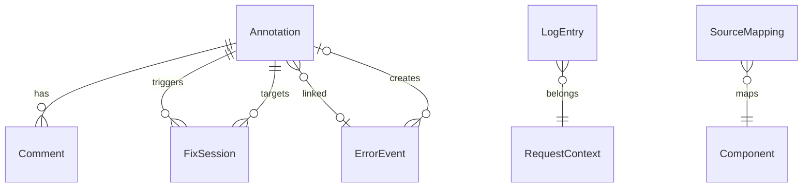
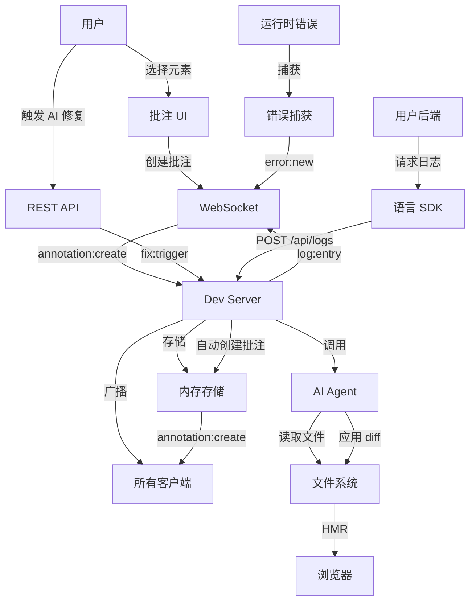

# CodeMark Spec 文档重构 Implementation Plan

> **For agentic workers:** REQUIRED SUB-SKILL: Use superpowers:subagent-driven-development (recommended) or superpowers:executing-plans to implement this plan task-by-task. Steps use checkbox (`- [ ]`) syntax for tracking.

**Goal:** 将单一需求文档拆分为 15 个模块化 spec 文件，补充数据模型、API 协议、UX 流程和技术细节。

**Architecture:** 按功能模块拆分 spec（annotation、ai-agent、build、communication、error-system），每个模块有独立的数据模型和接口定义。所有 spec 使用中文撰写，包含 TypeScript 接口定义和 Mermaid 流程图。按依赖顺序分 8 个阶段执行。

**Tech Stack:** TypeScript (接口定义), Mermaid (流程图), Markdown (文档格式)

---

## 文件结构总览

```
.spec/
├── overview.md                  # 项目定位、设计原则、技术决策、包结构、术语表
├── annotation/
│   ├── data-model.md            # 7 个核心实体的 TypeScript 接口
│   ├── interaction.md           # 6 个 UX 流程 + 边界情况
│   └── dom-binding.md           # DOM → 组件 → 源码映射机制
├── communication/
│   ├── websocket.md             # 13 个 WebSocket 事件协议
│   └── rest-api.md              # 12 个 REST 端点
├── build/
│   ├── injection.md             # Vite 插件注入 + 生产构建移除
│   └── language-agnostic.md     # 后端语言无关 SDK 契约
├── error-system/
│   ├── frontend-capture.md      # 前端错误捕获 4 种机制
│   ├── backend-capture.md       # 后端错误捕获 + 请求上下文
│   └── error-to-annotation.md   # 错误 → 自动批注管线
├── ai-agent/
│   ├── architecture.md          # 多模型抽象层 + Agent 工作流
│   ├── fix-pipeline.md          # AI 修复状态机
│   └── spec-generation.md       # Spec 驱动代码生成
├── cross-cutting.md             # 模块交互 + 数据流 + 启动序列
└── acceptance-criteria.md       # 每模块验收标准
```

---

## Task 1: 创建目录结构

**Files:**
- Create: `.spec/annotation/` (directory)
- Create: `.spec/ai-agent/` (directory)
- Create: `.spec/build/` (directory)
- Create: `.spec/communication/` (directory)
- Create: `.spec/error-system/` (directory)

- [ ] **Step 1: 创建所有 spec 子目录**

```bash
mkdir -p .spec/{annotation,ai-agent,build,communication,error-system}
```

- [ ] **Step 2: 验证目录结构**

```bash
find .spec -type d | sort
```

Expected output:
```
.spec
.spec/ai-agent
.spec/annotation
.spec/build
.spec/communication
.spec/error-system
```

- [ ] **Step 3: Commit**

```bash
git add .spec/
git commit -m "chore: create spec directory structure"
```

---

## Task 2: 编写 overview.md — 项目总览

**Files:**
- Create: `.spec/overview.md`

- [ ] **Step 1: 编写 overview.md**

```markdown
# CodeMark 项目总览

> AI + 批注驱动的开发框架

## 项目定位

CodeMark 是一个**纯开发阶段**的批注驱动开发工具。用户在运行中的 Web 页面上像 Word 批注一样标记问题，AI 自动理解批注并修改代码。CodeMark 不是框架、不是库、不会进入生产构建。

## 设计原则

1. **Dev-Only** — CodeMark 仅在开发阶段存在，生产构建完全移除
2. **非侵入** — 通过插件/中间件注入，不修改用户项目结构
3. **批注→代码绑定** — 每个批注必须关联到具体的源码位置
4. **AI-First** — 批注的核心价值是驱动 AI 自动修复
5. **实时协作** — 多人可通过 WebSocket 实时查看和操作批注

## 技术决策

| 层级 | 决策 | 说明 |
|------|------|------|
| 前端批注 UI | 原生 JS + Web Components | 框架无关，通过 Shadow DOM 隔离 |
| 前端框架支持 | Vue 3 优先，React 18+ 后续 | 通过薄适配层支持多框架 |
| 构建工具 | Vite 优先，Webpack 后续 | Vite 插件注入批注 UI |
| 后端 | 语言无关 | 通过 request-ID 日志捕获，每语言实现薄模块 |
| AI | 多模型抽象层 | 支持 Claude、OpenAI 等，可切换 |
| 通信 | WebSocket | 实时批注同步、AI 修复进度、错误推送 |
| 存储 | 内存 + 可选文件持久化 | 开发阶段数据，无需数据库 |

## 包结构

```
codemark/
├── packages/
│   ├── core/              # 核心逻辑：数据模型、事件总线、工具函数
│   ├── frontend/          # 批注 UI：原生 JS + Web Components
│   ├── vite-plugin/       # Vite 插件：注入批注 UI、源码映射
│   ├── webpack-plugin/    # Webpack 插件（后续）
│   ├── server/            # 开发服务器：WebSocket、REST API、AI 代理调度
│   ├── ai-agent/          # AI 代码修改代理：多模型抽象、修复管线
│   └── sdk-node/          # Node.js SDK：请求上下文 + 日志捕获
├── examples/
│   ├── vue-app/           # Vue 3 示例项目
│   └── react-app/         # React 18+ 示例项目（后续）
└── docs/
```

### 包依赖关系

```
frontend → core
vite-plugin → core, frontend
server → core, ai-agent
ai-agent → core
sdk-node → core
webpack-plugin → core, frontend（后续）
```

## 非目标

CodeMark **不是**：
- CI/CD 工具
- 生产环境错误监控（如 Sentry）
- 代码编辑器
- 项目管理工具
- 部署工具

## 术语表

| 术语 | 定义 |
|------|------|
| 批注 (Annotation) | 用户在页面上标记的问题或建议，绑定到 DOM 元素和源码位置 |
| 评论 (Comment) | 批注下的回复，支持用户、系统、AI 三种类型 |
| 修复会话 (FixSession) | AI 修复一次批注的完整生命周期，从分析到验证 |
| DOM 绑定 (DOM Binding) | 批注与页面 DOM 元素的关联关系 |
| 源码映射 (Source Mapping) | DOM 元素到源码文件位置的映射 |
| 请求上下文 (Request Context) | 后端请求的唯一标识 + 关联日志集合 |
| Spec | `.spec/` 目录下的需求规格文档 |
| Plan | AI 解析 Spec 后生成的结构化项目计划 |
```

- [ ] **Step 2: 验证内容完整性**

检查 overview.md 包含以下所有章节：
- [x] 项目定位
- [x] 设计原则（5 条）
- [x] 技术决策表（7 行）
- [x] 包结构 + 依赖关系
- [x] 非目标
- [x] 术语表（8 个术语）

- [ ] **Step 3: Commit**

```bash
git add .spec/overview.md
git commit -m "docs: add project overview spec"
```

---

## Task 3: 编写 annotation/data-model.md — 核心数据模型

**Files:**
- Create: `.spec/annotation/data-model.md`

- [ ] **Step 1: 编写 data-model.md**

这是所有其他 spec 的基础，定义 7 个核心实体的完整 TypeScript 接口。

文件内容需要包含：

**1. Annotation（批注）— 核心实体**

```typescript
interface Annotation {
  id: string                    // UUID
  projectId: string
  target: AnnotationTarget      // DOM 绑定 + 源码位置
  status: 'open' | 'resolved' | 'wontfix'
  type: 'manual' | 'auto-error' | 'ai-generated'
  content: string               // 批注文本
  severity?: 'info' | 'warning' | 'error'
  createdBy: string             // 用户标识
  createdAt: number             // Unix timestamp ms
  updatedAt: number
  comments: Comment[]
}

interface AnnotationTarget {
  // DOM 绑定（运行时定位）
  domSelector: string           // CSS 选择器路径
  domXPath?: string             // XPath 备选
  elementSnapshot?: string      // 元素 outerHTML 快照（用于元素消失后恢复）
  // 源码绑定（代码定位）
  sourceFile: string            // 相对于项目根目录的文件路径
  sourceLine: number
  sourceColumn: number
  componentName: string         // Vue/React 组件名
  framework: 'vue' | 'react' | 'unknown'
}
```

**2. Comment（评论）**

```typescript
interface Comment {
  id: string
  annotationId: string
  author: string
  content: string
  type: 'user' | 'system' | 'ai'
  createdAt: number
}
```

`type` 说明：
- `user` — 用户手动输入
- `system` — 系统自动生成（如 "AI 修复已应用"、"错误自动检测"）
- `ai` — AI 生成的分析或建议

**3. FixSession（修复会话）**

```typescript
interface FixSession {
  id: string
  annotationId: string
  state: FixSessionState
  aiProvider: string            // 'claude' | 'openai' | ...
  aiModel: string
  proposedDiff?: string         // unified diff 格式
  appliedDiff?: string          // 实际应用的 diff（可能被用户编辑）
  verificationResult?: VerificationResult
  startedAt: number
  completedAt?: number
  error?: string                // 失败时的错误信息
}

type FixSessionState =
  | 'pending'
  | 'gathering-context'
  | 'analyzing'
  | 'proposing'
  | 'awaiting-approval'
  | 'applying'
  | 'verifying'
  | 'done'
  | 'failed'
  | 'rolled-back'

interface VerificationResult {
  hasNewErrors: boolean
  newErrors: ErrorEvent[]
  testsPassed: boolean | null    // null = 未运行测试
  targetElementExists: boolean
}
```

**4. ErrorEvent（错误事件）**

```typescript
interface ErrorEvent {
  id: string
  source: 'frontend' | 'backend'
  type: ErrorEventType
  message: string
  stack?: StackFrame[]
  requestId?: string            // 后端错误关联的请求 ID
  linkedAnnotationId?: string   // 关联的批注 ID
  timestamp: number
  dedupHash: string             // 去重哈希
}

type ErrorEventType =
  | 'console-error'
  | 'console-warn'
  | 'unhandled-promise'
  | 'global-error'
  | 'component-error'
  | 'uncaught-exception'
  | 'api-error'

interface StackFrame {
  file: string
  line: number
  column: number
  function?: string
  isAppCode: boolean            // 是否为应用代码（非 node_modules/框架内部）
}
```

**5. LogEntry（日志条目）**

```typescript
interface LogEntry {
  id: string
  requestId: string
  level: 'debug' | 'info' | 'warn' | 'error'
  message: string
  timestamp: number
  source: string                // 日志来源标识
  metadata?: Record<string, unknown>
}
```

**6. SourceMapping（源码映射）**

```typescript
interface SourceMapping {
  domSelector: string
  filePath: string              // 相对于项目根目录
  line: number
  column: number
  componentName: string
  framework: 'vue' | 'react'
  timestamp: number             // 映射创建/更新时间
}
```

**7. ProjectConfig（项目配置）**

```typescript
interface ProjectConfig {
  projectRoot: string
  framework: 'vue' | 'react'
  buildTool: 'vite' | 'webpack'
  aiProvider: 'claude' | 'openai' | 'local'
  aiModel: string
  aiApiKey?: string             // 环境变量引用，不存储实际 key
  autoFixEnabled: boolean
  autoFixRequiresApproval: boolean
  errorStormThreshold: number   // 每分钟最大自动批注数
  logLevel: 'debug' | 'info' | 'warn' | 'error'
}
```

**8. 实体关系图（Mermaid）**



- [ ] **Step 2: 验证数据模型完整性**

检查 data-model.md 包含：
- [x] 7 个实体的完整 TypeScript 接口
- [x] 所有枚举类型定义
- [x] 实体关系图
- [x] 每个字段有注释说明

- [ ] **Step 3: 验证跨模型引用一致性**

检查以下引用关系：
- [x] `Annotation.comments` 引用 `Comment[]`
- [x] `Comment.annotationId` 引用 `Annotation.id`
- [x] `FixSession.annotationId` 引用 `Annotation.id`
- [x] `ErrorEvent.linkedAnnotationId` 引用 `Annotation.id`
- [x] `LogEntry.requestId` 为必填字段

- [ ] **Step 4: Commit**

```bash
git add .spec/annotation/data-model.md
git commit -m "docs: add core data model spec with 7 entity definitions"
```

---

## Task 4: 编写 communication/websocket.md — WebSocket 协议

**Files:**
- Create: `.spec/communication/websocket.md`

依赖: Task 3 (data-model.md 中定义的类型)

- [ ] **Step 1: 编写 websocket.md**

文件内容需要包含：

**1. 连接生命周期**

```markdown
## 连接生命周期

### 建立连接
- 客户端通过 `ws://localhost:{port}/codemark` 连接
- 连接时发送 `handshake` 事件，包含 `projectId` 和 `clientType`（'frontend' | 'ide' | 'cli'）
- 服务端回复 `handshake:ack`，包含连接 ID 和当前项目状态

### 心跳
- 服务端每 30 秒发送 `ping`
- 客户端回复 `pong`
- 超过 3 次未回复，服务端断开连接

### 断线重连
- 客户端自动重连，指数退避（1s, 2s, 4s, 8s, 最大 30s）
- 重连后重新发送 `handshake`
- 服务端推送断线期间的增量事件
```

**2. 消息格式**

```typescript
interface WebSocketMessage {
  event: string
  payload: unknown
  timestamp: number
  messageId: string             // 用于去重和确认
}
```

**3. 13 个事件定义（每个需要：名称、方向、payload 类型、说明、错误情况）**

批注 CRUD 事件：

```typescript
// annotation:create — 创建批注
// 方向: client → server → broadcast
interface AnnotationCreatePayload {
  annotation: Annotation
}

// annotation:update — 更新批注内容
// 方向: client → server → broadcast
interface AnnotationUpdatePayload {
  id: string
  changes: Pick<Annotation, 'content' | 'severity'>
}

// annotation:delete — 删除批注
// 方向: client → server → broadcast
interface AnnotationDeletePayload {
  id: string
}

// annotation:resolve — 解决/重新打开批注
// 方向: client → server → broadcast
interface AnnotationResolvePayload {
  id: string
  status: 'resolved' | 'wontfix' | 'open'
}
```

评论事件：

```typescript
// comment:add — 添加评论
// 方向: client → server → broadcast
interface CommentAddPayload {
  annotationId: string
  comment: Comment
}
```

AI 修复事件：

```typescript
// fix:start — 修复开始
// 方向: server → client
interface FixStartPayload {
  annotationId: string
  fixSessionId: string
}

// fix:progress — 修复进度更新
// 方向: server → client
interface FixProgressPayload {
  fixSessionId: string
  state: FixSessionState
  message: string
}

// fix:proposal — AI 提出修复方案
// 方向: server → client
interface FixProposalPayload {
  fixSessionId: string
  diff: string                  // unified diff
  summary: string               // AI 的修复说明
}

// fix:apply — 用户批准修复
// 方向: client → server
interface FixApplyPayload {
  fixSessionId: string
  approvedDiff: string          // 可能被用户编辑过的 diff
}

// fix:result — 修复结果
// 方向: server → client
interface FixResultPayload {
  fixSessionId: string
  status: 'done' | 'failed' | 'rolled-back'
  error?: string
  verificationResult?: VerificationResult
}
```

错误与日志事件：

```typescript
// error:new — 新错误
// 方向: server → client
interface ErrorNewPayload {
  errorEvent: ErrorEvent
}

// log:entry — 后端日志条目
// 方向: server → client
interface LogEntryPayload {
  log: LogEntry
}

// source:map — 源码映射更新
// 方向: server → client
interface SourceMapPayload {
  filePath: string
  mappings: SourceMapping[]
}
```

**4. 错误处理**

```markdown
## 错误处理

### 事件发送失败
- 客户端维护发送队列，断线期间事件入队
- 重连后按顺序重发队列中的事件
- 服务端通过 `messageId` 去重

### 事件处理失败
- 服务端处理事件失败时，回复 `error` 事件给发送方
- `error` payload: `{ code: string, message: string, originalEvent: string }`

### 未知事件
- 收到未知事件名时，回复 `error` 事件，code 为 `UNKNOWN_EVENT`
```

- [ ] **Step 2: 验证事件覆盖**

检查 websocket.md 覆盖以下所有场景：
- [x] 批注 CRUD（4 个事件）
- [x] 评论（1 个事件）
- [x] AI 修复生命周期（5 个事件）
- [x] 错误与日志（3 个事件）
- [x] 连接生命周期（handshake, ping/pong）
- [x] 错误处理

- [ ] **Step 3: 验证与 data-model.md 的类型一致性**

检查所有 payload 类型引用的实体字段与 data-model.md 一致：
- [x] `Annotation` 字段匹配
- [x] `Comment` 字段匹配
- [x] `FixSession` 字段匹配
- [x] `ErrorEvent` 字段匹配
- [x] `LogEntry` 字段匹配
- [x] `SourceMapping` 字段匹配

- [ ] **Step 4: Commit**

```bash
git add .spec/communication/websocket.md
git commit -m "docs: add WebSocket protocol spec with 13 events"
```

---

## Task 5: 编写 communication/rest-api.md — REST API

**Files:**
- Create: `.spec/communication/rest-api.md`

依赖: Task 3 (data-model.md)

- [ ] **Step 1: 编写 rest-api.md**

定义 12 个 REST 端点，每个包含：路径、方法、请求体、响应体、错误码。

```markdown
# REST API 规范

Base URL: `http://localhost:{port}/api`

## 批注相关

### GET /api/annotations
查询批注列表。

Query 参数:
- `status`?: 'open' | 'resolved' | 'wontfix'
- `type`?: 'manual' | 'auto-error' | 'ai-generated'
- `limit`?: number (default: 50)
- `offset`?: number (default: 0)

Response: `{ annotations: Annotation[], total: number }`

### POST /api/annotations
创建批注。同时触发 WebSocket `annotation:create` 广播。

Request body: `Pick<Annotation, 'target' | 'content' | 'severity' | 'type' | 'createdBy'>`
Response: `{ annotation: Annotation }`

### PATCH /api/annotations/:id
更新批注。

Request body: `Partial<Pick<Annotation, 'content' | 'severity' | 'status'>>`
Response: `{ annotation: Annotation }`
Error: 404 — 批注不存在

### DELETE /api/annotations/:id
删除批注。
Response: `{ success: true }`
Error: 404 — 批注不存在

### POST /api/annotations/:id/comments
添加评论。

Request body: `Pick<Comment, 'content' | 'author'>`
Response: `{ comment: Comment }`
Error: 404 — 批注不存在

## AI 修复相关

### POST /api/fix/trigger
手动触发 AI 修复。

Request body: `{ annotationId: string }`
Response: `{ fixSessionId: string }`
Error: 404 — 批注不存在; 409 — 已有进行中的修复会话

### GET /api/fix/:sessionId
查询修复会话状态。

Response: `{ fixSession: FixSession }`
Error: 404 — 会话不存在

### POST /api/fix/:sessionId/approve
批准修复方案。

Request body: `{ approvedDiff?: string }` （可选编辑后的 diff）
Response: `{ fixSession: FixSession }`
Error: 404 — 会话不存在; 409 — 会话不在 awaiting-approval 状态

## 错误与日志

### GET /api/errors
查询错误列表。

Query 参数:
- `source`?: 'frontend' | 'backend'
- `type`?: ErrorEventType
- `limit`?: number (default: 50)
- `offset`?: number (default: 0)

Response: `{ errors: ErrorEvent[], total: number }`

### GET /api/logs/:requestId
查询请求关联日志。

Response: `{ logs: LogEntry[] }`
Error: 404 — 无此请求的日志

## 项目配置

### GET /api/project/config
获取项目配置。

Response: `{ config: ProjectConfig }`

## Spec 生成

### POST /api/spec/generate
触发 Spec 驱动代码生成。

Request body: `{ specFiles?: string[] }` （可选指定文件，默认全部）
Response: `{ planId: string, status: 'started' }`
```

- [ ] **Step 2: 验证端点覆盖**

检查 rest-api.md 覆盖：
- [x] 批注 CRUD（5 个端点）
- [x] AI 修复（3 个端点）
- [x] 错误与日志（2 个端点）
- [x] 项目配置（1 个端点）
- [x] Spec 生成（1 个端点）
- [x] 每个端点有请求/响应/错误码

- [ ] **Step 3: Commit**

```bash
git add .spec/communication/rest-api.md
git commit -m "docs: add REST API spec with 12 endpoints"
```

---

## Task 6: 编写 annotation/dom-binding.md — DOM 绑定机制

**Files:**
- Create: `.spec/annotation/dom-binding.md`

依赖: Task 3 (data-model.md 中的 SourceMapping, AnnotationTarget)

- [ ] **Step 1: 编写 dom-binding.md**

```markdown
# DOM 绑定与源码映射

## 概述

DOM 绑定是批注系统的核心桥梁：将页面上的视觉元素关联到源码文件的具体位置。
这个映射是双向的：
- **DOM → 源码**：用户点击页面元素时，定位到对应源码
- **源码 → DOM**：AI 修改源码后，找到对应的页面元素验证修复

## DOM 选择器策略

批注通过多层选择器定位 DOM 元素，按优先级排列：

### 1. 组件路径选择器（优先）
```
App > Sidebar > NavItem[2] > Button
```
基于组件层级路径，对 DOM 结构变化有较强容错性。

### 2. CSS 选择器
```
#app > div.sidebar > nav > ul > li:nth-child(2) > button.submit
```
精确但脆弱，DOM 结构变化后容易失效。

### 3. XPath
```
/html/body/div[1]/nav/ul/li[2]/button
```
作为 CSS 选择器的备选。

### 选择器生成算法

```typescript
function generateSelector(element: Element): AnnotationTarget {
  // 1. 检查元素是否有组件元数据（__file, __source）
  //    有 → 使用组件路径选择器 + 源码位置
  // 2. 生成最短唯一 CSS 选择器
  // 3. 同时记录 XPath 作为备选
  // 4. 保存元素 outerHTML 快照（用于元素消失后识别）
}
```

### 选择器稳定性

| 场景 | 组件路径 | CSS 选择器 | XPath |
|------|---------|-----------|-------|
| 元素移动位置 | ✓ 容错 | ✗ 失效 | ✗ 失效 |
| 同级元素增删 | ✓ 容错 | ✗ 失效 | ✗ 失效 |
| 组件重命名 | ✗ 失效 | ✓ 有效 | ✓ 有效 |
| 动态 class 变化 | ✓ 容错 | ✗ 失效 | ✓ 有效 |

## 源码位置注入

### Vue 3
Vite 开发模式下，Vue 编译器自动在 VNode 上注入 `__file` 属性：
```javascript
// 编译后
{ __file: 'src/components/Button.vue', __line: 15, __column: 3 }
```

### React
通过 `@babel/plugin-transform-react-jsx-source` 注入 `__source` 属性：
```javascript
// 编译后
{ __source: { fileName: 'src/components/Button.tsx', lineNumber: 15, columnNumber: 3 } }
```

### 统一元数据格式

CodeMark 的 Vite 插件将框架特定的元数据统一为：
```typescript
interface ComponentMeta {
  framework: 'vue' | 'react'
  filePath: string              // 相对于项目根目录
  line: number
  column: number
  componentName: string
}
```

## 源码映射存储

### 开发服务器端
```typescript
// 内存存储，按项目组织
class SourceMapStore {
  private maps: Map<string, SourceMapping[]>  // key: filePath

  update(filePath: string, mappings: SourceMapping[]): void
  getByDomSelector(selector: string): SourceMapping | null
  getBySourceLocation(file: string, line: number): SourceMapping | null
  removeByFile(filePath: string): void
}
```

### 映射更新时机
1. **页面加载** — Vite 插件解析所有组件，建立初始映射
2. **HMR 更新** — 文件修改后，更新该文件的映射
3. **路由切换** — SPA 路由变化时，新页面的组件需要建立映射

## 失效处理

### 源码文件变更
- HMR 重新渲染 → 映射自动更新
- 如果组件被删除 → 关联批注标记为 `stale`，UI 显示灰色标记

### DOM 结构变化
- 尝试按优先级依次使用：组件路径 → CSS 选择器 → XPath
- 全部失败 → 使用 `elementSnapshot` 进行模糊匹配
- 模糊匹配也失败 → 批注标记为 `stale`

### 组件层级变化
- 组件路径选择器失效 → 降级到 CSS 选择器
- 记录失效原因，供 AI 修复时参考
```

- [ ] **Step 2: 验证完整性**

检查 dom-binding.md 包含：
- [x] 选择器策略（3 层优先级）
- [x] 源码位置注入（Vue + React）
- [x] 统一元数据格式
- [x] 映射存储设计
- [x] 失效处理（3 种场景）

- [ ] **Step 3: Commit**

```bash
git add .spec/annotation/dom-binding.md
git commit -m "docs: add DOM binding and source mapping spec"
```

---

## Task 7: 编写 annotation/interaction.md — 交互流程

**Files:**
- Create: `.spec/annotation/interaction.md`

依赖: Task 3 (data-model.md), Task 4 (websocket.md), Task 6 (dom-binding.md)

- [ ] **Step 1: 编写 interaction.md**

定义 6 个 UX 流程，每个包含：流程图、步骤、边界情况。

```markdown
# 批注交互流程

## 1. 批注创建流程

### 流程图
用户选择元素 → 选择工具栏出现 → 点击"添加批注" → 输入框弹出 → 输入内容 → 提交 → WebSocket 广播

### 详细步骤
1. 用户在页面上拖拽选择文本或点击元素
2. 选择区域上方出现浮动工具栏，包含"添加批注"按钮
3. 点击按钮，弹出批注输入框（Popover）
4. 输入框包含：文本区域、严重程度选择（info/warning/error）、提交按钮
5. 用户输入内容，点击提交
6. 前端调用 `POST /api/annotations`
7. 服务端创建批注，通过 WebSocket 广播 `annotation:create`
8. 所有连接的客户端在页面上显示批注标记

### 边界情况
- **跨组件选择**：选择区域跨越多个组件 → 取最外层共同父组件
- **空区域选择**：选择无内容区域 → 工具栏不出现
- **iframe 内选择**：暂不支持，显示提示
- **网络失败**：提交失败时保留输入内容，显示重试按钮
- **重复批注**：同一元素已有批注时，提示用户是否追加评论

## 2. 批注详情与回复

### 流程图
点击批注标记 → 侧边面板展开 → 显示评论列表 → 输入回复 → 提交 → WebSocket 广播

### 详细步骤
1. 用户点击页面上的批注标记（气泡/高亮）
2. 右侧边面板滑出，显示该批注的完整信息
3. 面板顶部：批注内容、创建时间、严重程度、状态
4. 面板中部：评论时间线（按时间正序）
5. 面板底部：回复输入框 + 提交按钮
6. 用户输入回复，点击提交
7. 前端调用 `POST /api/annotations/:id/comments`
8. 服务端通过 WebSocket 广播 `comment:add`

### 边界情况
- **长评论列表**：超过 20 条时分页加载
- **并发回复**：多人同时回复 → WebSocket 实时推送，无需刷新
- **富文本**：V1 仅支持纯文本，后续考虑 Markdown

## 3. 批注状态管理

### 状态转换
```
open → resolved（用户标记已修复）
open → wontfix（用户标记不处理）
resolved → open（重新打开）
wontfix → open（重新打开）
```

### 自动状态变更
- AI 修复验证成功后 → 自动标记为 `resolved`（可配置关闭）

### 边界情况
- **AI 修复进行中**：用户尝试手动 resolve → 显示确认对话框
- **批量操作**：批注列表面板支持批量 resolve

## 4. 批注列表面板

### 功能
- 显示所有批注的摘要列表
- 筛选：按状态（open/resolved/wontfix）、按类型（manual/auto-error/ai-generated）
- 排序：按创建时间、严重程度
- 点击批注 → 页面滚动到对应元素并高亮
- 搜索：按内容关键词搜索

### 边界情况
- **大量批注**：超过 100 条时使用虚拟滚动
- **失效批注**：目标元素不存在的批注显示为灰色，标记 "stale"

## 5. 批注可视化

### 标记样式
- **行内元素**：下划线 + 背景色（类似 Grammarly）
- **块级元素**：边框高亮 + 右上角气泡图标
- **气泡图标**：显示批注数量，点击展开详情

### 标记定位
- 使用 `position: absolute` 相对于目标元素定位
- 监听 `scroll`、`resize` 事件，实时更新位置
- 使用 `IntersectionObserver` 检测元素是否可见

### 边界情况
- **重叠批注**：同一元素多个批注 → 合并为一个气泡，显示数量
- **隐藏元素**：元素 `display: none` → 批注标记隐藏，列表中仍显示
- **滚动容器内**：批注标记跟随滚动容器，不跟随页面

## 6. 批注快捷操作

### 快捷键
- `Ctrl+Shift+A`：快速添加批注（选中元素后）
- `Escape`：关闭当前批注面板
- `Ctrl+Shift+M`：切换批注列表面板

### 右键菜单
- 选中元素后右键 → 菜单项 "添加 CodeMark 批注"
```

- [ ] **Step 2: 验证流程覆盖**

检查 interaction.md 包含：
- [x] 批注创建（含 5 个边界情况）
- [x] 批注详情与回复（含 3 个边界情况）
- [x] 状态管理（含自动状态变更）
- [x] 列表面板（含筛选/排序/搜索）
- [x] 可视化（含 3 个边界情况）
- [x] 快捷操作

- [ ] **Step 3: Commit**

```bash
git add .spec/annotation/interaction.md
git commit -m "docs: add annotation interaction flows spec"
```

---

## Task 8: 编写 build/injection.md — Vite 插件注入

**Files:**
- Create: `.spec/build/injection.md`

- [ ] **Step 1: 编写 injection.md**

```markdown
# 构建注入机制

## Vite 插件

### 插件职责
1. 在 HTML 中注入 CodeMark 客户端脚本
2. 提供虚拟模块 `virtual:codemark/state` 供批注 UI 使用
3. 监听源码变更，更新源码映射
4. 在生产构建时完全移除 CodeMark 代码

### 注入方式

#### HTML 注入
插件在 `transformIndexHtml` 钩子中注入：
```html
<script type="module" src="/@codemark/client"></script>
```
注入位置在 `</body>` 之前。

#### 虚拟模块
```javascript
// virtual:codemark/state — 批注状态的响应式代理
export const annotations = reactive([])
export const config = reactive({})
export const ws = createWebSocketClient()
```

#### 入口文件包装
插件在 `resolveId` + `load` 钩子中包装用户的 `main.ts`：
```javascript
// 原始: import App from './App.vue'
// 包装后:
import { initCodeMark } from '@codemark/frontend'
import App from './App.vue'
initCodeMark()  // 初始化批注覆盖层
// ... 原始 main.ts 逻辑
```

### 生产构建移除

```typescript
// vite-plugin/index.ts
export function codemarkPlugin(): Plugin {
  return {
    name: 'vite-plugin-codemark',
    apply: 'serve',  // 仅在 dev 模式生效

    // 以下钩子仅在 apply: 'serve' 时执行
    transformIndexHtml(html) { /* 注入脚本 */ },
    resolveId(id) { /* 虚拟模块 */ },
    load(id) { /* 虚拟模块内容 */ },
  }
}
```

关键：`apply: 'serve'` 确保插件在 `vite build` 时不执行，生产构建中零 CodeMark 代码。

### 验证生产构建

```bash
# 构建后检查
grep -r "codemark" dist/  # 应无结果
grep -r "@codemark" dist/  # 应无结果
```

## Webpack 插件（后续）

### 对等实现要求
- 相同的 HTML 注入位置
- 相同的虚拟模块接口
- 相同的入口文件包装逻辑
- 使用 `mode: 'development'` 判断是否启用

### 差异点
- Webpack 使用 `html-webpack-plugin` 的 hooks 注入 HTML
- Webpack 使用 `NormalModuleReplacementPlugin` 实现虚拟模块
- HMR 通过 Webpack Dev Server 的 HMR API

## SSR 处理

### Vue SSR
- CodeMark 仅在客户端注入，服务端渲染时跳过
- 通过 `process.client` 或 `typeof window !== 'undefined'` 判断

### Next.js
- 仅在 `_app.tsx` 的客户端部分初始化
- 使用 `dynamic(() => import('@codemark/client'), { ssr: false })`
```

- [ ] **Step 2: Commit**

```bash
git add .spec/build/injection.md
git commit -m "docs: add Vite plugin injection spec"
```

---

## Task 9: 编写 build/language-agnostic.md — 语言无关后端

**Files:**
- Create: `.spec/build/language-agnostic.md`

- [ ] **Step 1: 编写 language-agnostic.md**

```markdown
# 语言无关后端 SDK

## 设计理念

CodeMark 不提供单体后端 SDK。每种语言实现一个轻量模块，遵循统一的接口契约。
核心思路：**每个请求生成唯一 ID，捕获该请求期间的所有日志，通过统一格式上报。**

## 接口契约

每种语言的 SDK 必须实现以下 4 个函数：

```typescript
// 伪代码接口定义
interface CodeMarkSDK {
  // 初始化请求上下文，返回 requestId
  initRequestContext(): string

  // 记录日志（关联到当前请求）
  log(requestId: string, level: LogLevel, message: string, metadata?: object): void

  // 获取请求的所有日志
  getLogs(requestId: string): LogEntry[]

  // 结束请求上下文（触发日志上报）
  endRequestContext(requestId: string): void
}
```

## Node.js SDK（Phase 1）

### Express 中间件

```typescript
// sdk-node/src/middleware/express.ts
import { AsyncLocalStorage } from 'async_hooks'
import { randomUUID } from 'crypto'

const storage = new AsyncLocalStorage<{ requestId: string }>()

export function codemarkMiddleware() {
  return (req, res, next) => {
    const requestId = randomUUID()
    req.codemarkRequestId = requestId

    // 拦截 stdout/stderr
    const originalStdout = process.stdout.write
    const originalStderr = process.stderr.write

    storage.run({ requestId }, () => {
      // 捕获该请求期间的所有输出
      res.on('finish', () => {
        // 恢复原始 stdout/stderr
        // 上报日志到 CodeMark dev server
        reportLogs(requestId)
      })
      next()
    })
  }
}
```

### Koa 中间件

```typescript
// sdk-node/src/middleware/koa.ts
export function codemarkKoaMiddleware() {
  return async (ctx, next) => {
    const requestId = randomUUID()
    ctx.codemarkRequestId = requestId
    // 类似 Express 的实现
    await next()
    reportLogs(requestId)
  }
}
```

### 日志上报

```typescript
// sdk-node/src/reporter.ts
async function reportLogs(requestId: string) {
  const logs = getCollectedLogs(requestId)
  await fetch(`http://localhost:${CODEMARK_PORT}/api/logs`, {
    method: 'POST',
    headers: { 'Content-Type': 'application/json' },
    body: JSON.stringify({ requestId, logs })
  })
}
```

## Python SDK（Phase 2）

### WSGI 中间件

```python
# sdk-python/codemark/wsgi.py
import uuid
import threading

local = threading.local()

class CodeMarkMiddleware:
    def __init__(self, app):
        self.app = app

    def __call__(self, environ, start_response):
        request_id = str(uuid.uuid4())
        local.request_id = request_id
        # 捕获日志...
        return self.app(environ, start_response)
```

### ASGI 中间件

```python
# sdk-python/codemark/asgi.py
class CodeMarkMiddleware:
    def __init__(self, app):
        self.app = app

    async def __call__(self, scope, receive, send):
        if scope['type'] == 'http':
            request_id = str(uuid.uuid4())
            scope['codemark_request_id'] = request_id
        await self.app(scope, receive, send)
```

## Go SDK（Phase 2）

### HTTP 中间件

```go
// sdk-go/codemark/middleware.go
func CodeMarkMiddleware(next http.Handler) http.Handler {
    return http.HandlerFunc(func(w http.ResponseWriter, r *http.Request) {
        requestID := uuid.New().String()
        ctx := context.WithValue(r.Context(), requestIDKey, requestID)
        // 捕获日志...
        next.ServeHTTP(w, r.WithContext(ctx))
    })
}
```

## 统一日志格式

所有语言的 SDK 上报日志时，必须遵循以下格式：

```json
{
  "requestId": "uuid",
  "logs": [
    {
      "timestamp": 1234567890,
      "level": "info",
      "message": "GET /api/users 200 15ms",
      "source": "express",
      "metadata": { "method": "GET", "path": "/api/users", "status": 200 }
    }
  ]
}
```

## 与 CodeMark Dev Server 的桥接

1. SDK 通过 HTTP POST 上报日志到 `http://localhost:{port}/api/logs`
2. Dev Server 存储日志，关联 requestId
3. Dev Server 通过 WebSocket `log:entry` 事件推送到前端
4. AI Agent 可通过 `GET /api/logs/:requestId` 查询日志
```

- [ ] **Step 2: Commit**

```bash
git add .spec/build/language-agnostic.md
git commit -m "docs: add language-agnostic backend SDK spec"
```

---

## Task 10: 编写 error-system/frontend-capture.md — 前端错误捕获

**Files:**
- Create: `.spec/error-system/frontend-capture.md`

- [ ] **Step 1: 编写 frontend-capture.md**

```markdown
# 前端错误捕获

## 概述

CodeMark 在开发阶段拦截前端所有错误源，统一格式后通过 WebSocket 上报。

## 捕获机制

### 1. Console 拦截

```typescript
// 拦截 console.error 和 console.warn
function interceptConsole() {
  const originalError = console.error
  const originalWarn = console.warn

  console.error = (...args) => {
    originalError.apply(console, args)
    captureError({
      type: 'console-error',
      message: args.map(formatArg).join(' '),
      stack: new Error().stack
    })
  }

  console.warn = (...args) => {
    originalWarn.apply(console, args)
    captureError({
      type: 'console-warn',
      message: args.map(formatArg).join(' '),
      stack: new Error().stack
    })
  }
}
```

### 2. Promise 拦截

```typescript
window.addEventListener('unhandledrejection', (event) => {
  captureError({
    type: 'unhandled-promise',
    message: event.reason?.message || String(event.reason),
    stack: event.reason?.stack
  })
})
```

### 3. 全局错误

```typescript
window.addEventListener('error', (event) => {
  captureError({
    type: 'global-error',
    message: event.message,
    stack: event.error?.stack,
    source: event.filename,
    line: event.lineno,
    column: event.colno
  })
})
```

### 4. Vue 组件错误边界

```typescript
// 在 Vue app 初始化时注册
app.config.errorHandler = (err, instance, info) => {
  captureError({
    type: 'component-error',
    message: err.message,
    stack: err.stack,
    componentName: instance?.$options?.name || 'Unknown',
    info
  })
}
```

### 5. React 错误边界（后续）

```tsx
// 注入 CodeMark ErrorBoundary 组件
class CodeMarkErrorBoundary extends React.Component {
  componentDidCatch(error, info) {
    captureError({
      type: 'component-error',
      message: error.message,
      stack: error.stack,
      componentStack: info.componentStack
    })
  }
  render() { return this.props.children }
}
```

## 错误去重

```typescript
function dedupHash(error: CapturedError): string {
  return hash(error.type + error.message + error.source + error.line)
}

// 同一错误 5 秒内不重复上报
const recentErrors = new Map<string, number>()
function shouldReport(hash: string): boolean {
  const last = recentErrors.get(hash) || 0
  if (Date.now() - last < 5000) return false
  recentErrors.set(hash, Date.now())
  return true
}
```

## 错误上报

所有捕获的错误统一通过 WebSocket `error:new` 事件上报：

```typescript
function captureError(error: Omit<ErrorEvent, 'id' | 'timestamp' | 'dedupHash' | 'source'>) {
  const hash = dedupHash(error)
  if (!shouldReport(hash)) return

  const errorEvent: ErrorEvent = {
    id: crypto.randomUUID(),
    source: 'frontend',
    timestamp: Date.now(),
    dedupHash: hash,
    ...error
  }

  ws.send('error:new', { errorEvent })
}
```

## 初始化时机

CodeMark 客户端脚本在页面最早时机初始化错误捕获：
1. 在 `<head>` 中注入内联脚本（非模块），立即拦截
2. 在模块加载后，补充 Vue/React 错误边界
```

- [ ] **Step 2: Commit**

```bash
git add .spec/error-system/frontend-capture.md
git commit -m "docs: add frontend error capture spec"
```

---

## Task 11: 编写 error-system/backend-capture.md — 后端错误捕获

**Files:**
- Create: `.spec/error-system/backend-capture.md`

- [ ] **Step 1: 编写 backend-capture.md**

```markdown
# 后端错误捕获

## 概述

后端错误捕获依赖各语言 SDK 的请求上下文机制。核心思路：所有日志和错误都关联到 requestId。

## Node.js 捕获机制

### stdout/stderr 拦截

```typescript
import { AsyncLocalStorage } from 'async_hooks'

const requestStorage = new AsyncLocalStorage<string>()

function interceptStdio() {
  const originalStdoutWrite = process.stdout.write.bind(process.stdout)
  const originalStderrWrite = process.stderr.write.bind(process.stderr)

  process.stdout.write = (chunk: any, ...args: any[]) => {
    const requestId = requestStorage.getStore()
    if (requestId) {
      collectLog(requestId, 'info', String(chunk))
    }
    return originalStdoutWrite(chunk, ...args)
  }

  process.stderr.write = (chunk: any, ...args: any[]) => {
    const requestId = requestStorage.getStore()
    if (requestId) {
      collectLog(requestId, 'error', String(chunk))
    }
    return originalStderrWrite(chunk, ...args)
  }
}
```

### 未捕获异常

```typescript
process.on('uncaughtException', (err) => {
  const requestId = requestStorage.getStore()
  if (requestId) {
    collectLog(requestId, 'error', `Uncaught Exception: ${err.message}`, {
      stack: err.stack
    })
  }
})

process.on('unhandledRejection', (reason) => {
  const requestId = requestStorage.getStore()
  if (requestId) {
    collectLog(requestId, 'error', `Unhandled Rejection: ${reason}`)
  }
})
```

### API 请求/响应日志

```typescript
// Express 中间件
function requestLogger(req, res, next) {
  const start = Date.now()
  const requestId = req.codemarkRequestId

  res.on('finish', () => {
    collectLog(requestId, 'info', `${req.method} ${req.path} ${res.statusCode} ${Date.now() - start}ms`, {
      method: req.method,
      path: req.path,
      status: res.statusCode,
      duration: Date.now() - start
    })
  })

  next()
}
```

## Python 捕获机制

### stdout/stderr 拦截

```python
import sys
import threading

local = threading.local()

class StdoutInterceptor:
    def __init__(self, original):
        self.original = original

    def write(self, text):
        if text.strip() and hasattr(local, 'request_id'):
            collect_log(local.request_id, 'info', text)
        self.original.write(text)

sys.stdout = StdoutInterceptor(sys.__stdout__)
sys.stderr = StdoutInterceptor(sys.__stderr__)
```

### 异常捕获

```python
import sys

def excepthook(exc_type, exc_value, exc_tb):
    if hasattr(local, 'request_id'):
        collect_log(local.request_id, 'error',
                    f'{exc_type.__name__}: {exc_value}',
                    {'stack': traceback.format_tb(exc_tb)})

sys.excepthook = excepthook
```

## Go 捕获机制

### 拦截 os.Stdout

```go
// 使用 io.MultiWriter 同时写入原始输出和日志收集器
func interceptOutput(requestID string) {
    log.SetOutput(io.MultiWriter(os.Stdout, &logCollector{requestID: requestID}))
}
```

### panic 恢复

```go
func recoveryMiddleware(next http.Handler) http.Handler {
    return http.HandlerFunc(func(w http.ResponseWriter, r *http.Request) {
        defer func() {
            if err := recover(); err != nil {
                requestID := r.Context().Value(requestIDKey).(string)
                collectLog(requestID, "error", fmt.Sprintf("panic: %v", err))
            }
        }()
        next.ServeHTTP(w, r)
    })
}
```

## 统一日志格式

所有语言上报的日志必须遵循 `LogEntry` 格式（见 annotation/data-model.md）。
```

- [ ] **Step 2: Commit**

```bash
git add .spec/error-system/backend-capture.md
git commit -m "docs: add backend error capture spec"
```

---

## Task 12: 编写 error-system/error-to-annotation.md — 错误→批注管线

**Files:**
- Create: `.spec/error-system/error-to-annotation.md`

- [ ] **Step 1: 编写 error-to-annotation.md**

```markdown
# 错误 → 自动批注管线

## 概述

当前后端捕获到运行时错误时，自动在对应源码位置创建批注。
这使得开发者无需手动标记问题，错误会"自己说话"。

## 触发条件

```
ErrorEvent 被捕获
  → 检查是否有源码位置（stack 中有应用代码帧）
  → 检查该位置是否已有批注
  → 如果没有，创建 auto-error 类型批注
```

## 位置解析

### 堆栈解析

```typescript
function parseAppStackFrame(stack: string): StackFrame | null {
  const frames = parseStackTrace(stack)

  // 过滤出应用代码帧（排除 node_modules、框架内部）
  const appFrame = frames.find(frame => {
    return !frame.file.includes('node_modules')
      && !frame.file.includes('codemark')
      && !frame.file.includes('webpack')  // 框架运行时
      && frame.file.startsWith(projectRoot)
  })

  return appFrame || null
}
```

### DOM 元素关联

对于前端错误，堆栈中的源码位置需要关联到 DOM 元素：

```typescript
function sourceToDomElement(sourceFile: string, line: number): Element | null {
  // 1. 通过 SourceMapStore 查找
  const mapping = sourceMapStore.getBySourceLocation(sourceFile, line)
  if (mapping) {
    return document.querySelector(mapping.domSelector)
  }

  // 2. 通过组件名推断
  const component = findComponentByFile(sourceFile)
  if (component) {
    return findComponentRootElement(component)
  }

  return null
}
```

## 自动批注格式

```typescript
function createAutoAnnotation(errorEvent: ErrorEvent): Annotation {
  return {
    id: crypto.randomUUID(),
    projectId: currentProject.id,
    target: {
      domSelector: '',  // 如果能关联到 DOM 元素则填充
      sourceFile: errorEvent.stack?.[0]?.file || '',
      sourceLine: errorEvent.stack?.[0]?.line || 0,
      sourceColumn: errorEvent.stack?.[0]?.column || 0,
      componentName: '',
      framework: 'unknown'
    },
    status: 'open',
    type: 'auto-error',
    content: formatErrorContent(errorEvent),
    severity: errorEvent.type === 'console-warn' ? 'warning' : 'error',
    createdBy: 'codemark-system',
    createdAt: Date.now(),
    updatedAt: Date.now(),
    comments: [{
      id: crypto.randomUUID(),
      annotationId: '',  // 填充后设置
      author: 'codemark-system',
      content: formatErrorComment(errorEvent),
      type: 'system',
      createdAt: Date.now()
    }]
  }
}

function formatErrorContent(error: ErrorEvent): string {
  return `🔴 自动检测到错误\n\n${error.message}`
}

function formatErrorComment(error: ErrorEvent): string {
  const stack = error.stack?.slice(0, 5).map(f => `  at ${f.function || 'anonymous'} (${f.file}:${f.line}:${f.column})`).join('\n')
  return `**错误类型**: ${error.type}\n**消息**: ${error.message}\n**堆栈**:\n${stack}\n**时间**: ${new Date(error.timestamp).toLocaleString()}`
}
```

## 去重与抑制

### 同一错误去重

```typescript
// 同一位置的同一错误，30 秒内不重复创建批注
const recentAutoAnnotations = new Map<string, number>()

function shouldCreateAutoAnnotation(error: ErrorEvent): boolean {
  const key = `${error.dedupHash}`
  const last = recentAutoAnnotations.get(key) || 0
  if (Date.now() - last < 30_000) return false
  recentAutoAnnotations.set(key, Date.now())
  return true
}
```

### 错误风暴保护

```typescript
// 每分钟最多创建 N 个自动批注（N 由 ProjectConfig.errorStormThreshold 控制）
const autoAnnotationCount = { count: 0, windowStart: Date.now() }

function checkStormProtection(): boolean {
  const now = Date.now()
  if (now - autoAnnotationCount.windowStart > 60_000) {
    autoAnnotationCount.count = 0
    autoAnnotationCount.windowStart = now
  }
  autoAnnotationCount.count++
  return autoAnnotationCount.count <= config.errorStormThreshold
}
```

## 用户操作

自动批注创建后，用户可以：
1. **查看详情** — 点击批注查看完整错误信息和堆栈
2. **触发 AI 修复** — 从自动批注直接触发修复流程
3. **编辑批注** — 添加额外上下文信息
4. **忽略** — 标记为 `wontfix`
5. **删除** — 移除自动批注

## 与 AI 修复的联动

当用户从自动批注触发 AI 修复时，AI Agent 会收到额外的上下文：
- 完整的错误堆栈
- 错误发生时的请求日志（后端错误）
- 相关的其他错误事件
```

- [ ] **Step 2: Commit**

```bash
git add .spec/error-system/error-to-annotation.md
git commit -m "docs: add error-to-annotation pipeline spec"
```

---

## Task 13: 编写 ai-agent/architecture.md — AI 代理架构

**Files:**
- Create: `.spec/ai-agent/architecture.md`

- [ ] **Step 1: 编写 architecture.md**

```markdown
# AI 代理架构

## 多模型抽象层

### LLM Provider 接口

```typescript
interface LLMProvider {
  name: string

  // 同步完成
  complete(prompt: string, context: LLMContext): Promise<LLMResponse>

  // 流式完成
  stream(prompt: string, context: LLMContext): AsyncIterable<LLMChunk>
}

interface LLMContext {
  systemPrompt: string
  maxTokens: number
  temperature: number
  tools?: ToolDefinition[]
}

interface LLMResponse {
  content: string
  toolCalls?: ToolCall[]
  usage: { inputTokens: number; outputTokens: number }
}

interface LLMChunk {
  content?: string
  toolCalls?: ToolCall[]
}
```

### Provider 实现

```typescript
// Claude Provider
class ClaudeProvider implements LLMProvider {
  name = 'claude'
  private client: Anthropic

  async complete(prompt, context): Promise<LLMResponse> {
    const response = await this.client.messages.create({
      model: 'claude-sonnet-4-20250514',
      max_tokens: context.maxTokens,
      system: context.systemPrompt,
      messages: [{ role: 'user', content: prompt }],
      tools: context.tools
    })
    // 转换为统一格式
  }
}

// OpenAI Provider
class OpenAIProvider implements LLMProvider {
  name = 'openai'
  private client: OpenAI

  async complete(prompt, context): Promise<LLMResponse> {
    const response = await this.client.chat.completions.create({
      model: 'gpt-4o',
      // ...
    })
  }
}
```

### Provider 选择

```typescript
function getProvider(config: ProjectConfig): LLMProvider {
  switch (config.aiProvider) {
    case 'claude': return new ClaudeProvider(config.aiApiKey)
    case 'openai': return new OpenAIProvider(config.aiApiKey)
    case 'local': return new LocalProvider(config.aiModel)
    default: throw new Error(`Unknown provider: ${config.aiProvider}`)
  }
}
```

## Agent 工作流

### 工具定义

```typescript
interface ToolDefinition {
  name: string
  description: string
  parameters: Record<string, unknown>  // JSON Schema
}

// Agent 可用的工具
const agentTools: ToolDefinition[] = [
  {
    name: 'readFile',
    description: '读取项目中的文件内容',
    parameters: { path: { type: 'string', description: '相对于项目根目录的文件路径' } }
  },
  {
    name: 'writeFile',
    description: '写入文件内容（覆盖）',
    parameters: {
      path: { type: 'string' },
      content: { type: 'string' }
    }
  },
  {
    name: 'applyDiff',
    description: '应用 unified diff 到文件',
    parameters: {
      path: { type: 'string' },
      diff: { type: 'string', description: 'unified diff 格式' }
    }
  },
  {
    name: 'runTest',
    description: '运行匹配的测试',
    parameters: {
      pattern: { type: 'string', description: '测试文件匹配模式' }
    }
  },
  {
    name: 'getErrorLog',
    description: '获取请求的错误日志',
    parameters: {
      requestId: { type: 'string' }
    }
  },
  {
    name: 'getDOMStructure',
    description: '获取页面的 DOM 结构摘要',
    parameters: {}
  },
  {
    name: 'getComponentTree',
    description: '获取 Vue/React 组件树',
    parameters: {}
  },
  {
    name: 'resolveSourceMap',
    description: '解析源码映射',
    parameters: {
      domSelector: { type: 'string' }
    }
  }
]
```

### Agent 循环

```typescript
async function runAgent(task: string, context: AgentContext): Promise<AgentResult> {
  const messages = [
    { role: 'system', content: SYSTEM_PROMPT },
    { role: 'user', content: buildTaskPrompt(task, context) }
  ]

  // 工具循环（最多 10 轮）
  for (let i = 0; i < 10; i++) {
    const response = await provider.complete(messages, {
      systemPrompt: SYSTEM_PROMPT,
      maxTokens: 4096,
      temperature: 0.2,
      tools: agentTools
    })

    if (response.toolCalls?.length) {
      // 执行工具调用
      for (const call of response.toolCalls) {
        const result = await executeTool(call)
        messages.push({ role: 'tool', content: result })
      }
    } else {
      // Agent 返回了最终答案
      return parseAgentResult(response.content)
    }
  }

  throw new Error('Agent exceeded maximum iterations')
}
```

## 上下文管理

### 上下文组装

```typescript
function buildTaskPrompt(task: string, context: AgentContext): string {
  return `
## 任务
${task}

## 批注内容
${context.annotation.content}

## 目标文件
\`\`\`
${context.targetFile}
\`\`\`

## 相关错误
${context.errors.map(e => e.message).join('\n')}

## 相关日志
${context.logs.map(l => l.message).join('\n')}

## 组件树
${context.componentTree}
`
}
```

### Token 预算管理

当上下文超过 token 限制时，按以下优先级裁剪：
1. 组件树（可压缩为摘要）
2. 日志（保留最近 50 条）
3. 相关错误（保留最近 10 条）
4. 目标文件（保留注释行前后 50 行）

## 安全约束

Agent **禁止**：
- 修改项目根目录之外的文件
- 执行任意 shell 命令（仅允许 `runTest`）
- 访问生产环境端点
- 修改 `.spec/` 目录（除非用户明确批准）
- 读取 `.env` 或包含密钥的文件
```

- [ ] **Step 2: Commit**

```bash
git add .spec/ai-agent/architecture.md
git commit -m "docs: add AI agent architecture spec"
```

---

## Task 14: 编写 ai-agent/fix-pipeline.md — AI 修复管线

**Files:**
- Create: `.spec/ai-agent/fix-pipeline.md`

- [ ] **Step 1: 编写 fix-pipeline.md**

```markdown
# AI 修复管线

## 状态机

```
IDLE → ANALYZING → PROPOSING → AWAITING_APPROVAL → APPLYING → VERIFYING → DONE
                                                         ↓
                                                      FAILED → ROLLED_BACK
```

### 状态定义

| 状态 | 说明 |
|------|------|
| `pending` | 修复会话已创建，等待开始 |
| `gathering-context` | 收集上下文（源码、错误、日志） |
| `analyzing` | AI 分析问题根因 |
| `proposing` | AI 生成修复方案（diff） |
| `awaiting-approval` | 等待用户批准 |
| `applying` | 应用 diff 到源码 |
| `verifying` | 验证修复结果 |
| `done` | 修复完成 |
| `failed` | 修复失败 |
| `rolled-back` | 已回滚 |

## 触发条件

### 手动触发
用户在批注面板点击"AI 修复"按钮 → `POST /api/fix/trigger`

### 自动触发
自动批注创建时，如果 `ProjectConfig.autoFixEnabled` 为 true → 自动触发修复

## 详细流程

### 1. 收集上下文 (gathering-context)

```typescript
async function gatherContext(annotation: Annotation): Promise<AgentContext> {
  const [targetFile, errors, logs, componentTree] = await Promise.all([
    readFile(annotation.target.sourceFile),
    getRelatedErrors(annotation),
    getRelatedLogs(annotation),
    getComponentTree()
  ])

  return {
    annotation,
    targetFile,
    errors,
    logs,
    componentTree,
    sourceMap: await resolveSourceMap(annotation.target.domSelector)
  }
}
```

### 2. 分析 (analyzing)

AI 接收上下文后，输出分析结果：
- 问题根因
- 是否可自动修复
- 预估修复范围

### 3. 生成方案 (proposing)

AI 生成 unified diff 格式的修复方案：

```typescript
interface FixProposal {
  diff: string              // unified diff
  summary: string           // 修复说明
  affectedFiles: string[]   // 影响的文件列表
  estimatedChanges: number  // 预估变更行数
}
```

### 4. 等待批准 (awaiting-approval)

通过 WebSocket `fix:proposal` 推送到前端，用户可以：
- **批准** — 直接应用 diff
- **编辑** — 修改 diff 后应用
- **拒绝** — 取消修复

如果 `autoFixRequiresApproval` 为 false，跳过此步骤直接应用。

### 5. 应用 (applying)

```typescript
async function applyFix(fixSession: FixSession): Promise<void> {
  const diff = fixSession.appliedDiff || fixSession.proposedDiff

  // 备份原文件（用于回滚）
  const backup = await readFile(fixSession.targetFile)
  fixSession.backup = backup

  // 应用 diff
  await applyDiff(fixSession.targetFile, diff)

  // Vite HMR 自动触发热更新
  // 如果 HMR 失败，Dev Server 发送 full-reload 指令
}
```

### 6. 验证 (verifying)

```typescript
async function verifyFix(fixSession: FixSession): Promise<VerificationResult> {
  // 等待 HMR 完成
  await waitForHMR(5000)

  // 检查是否有新错误
  const newErrors = await getRecentErrors(fixSession.startedAt)

  // 运行相关测试
  const testResult = await runRelatedTests(fixSession.targetFile)

  // 检查目标元素是否仍然存在
  const elementExists = checkElementExists(fixSession.annotation.target.domSelector)

  return {
    hasNewErrors: newErrors.length > 0,
    newErrors,
    testsPassed: testResult,
    targetElementExists: elementExists
  }
}
```

### 7. 回滚 (rolled-back)

```typescript
async function rollbackFix(fixSession: FixSession): Promise<void> {
  if (fixSession.backup) {
    await writeFile(fixSession.targetFile, fixSession.backup)
    // HMR 自动恢复
  }
}
```

## 用户交互

### 进度显示
前端通过 WebSocket `fix:progress` 事件显示实时进度：
- 状态文字变化
- 进度条（如有预估时间）
- 可取消按钮

### 取消修复
用户在任意状态可以取消：
- `pending` / `gathering-context` / `analyzing` → 直接取消
- `proposing` → 取消，丢弃已生成的方案
- `awaiting-approval` → 取消
- `applying` → 等待当前应用完成后回滚
- `verifying` → 等待验证完成后回滚
```

- [ ] **Step 2: Commit**

```bash
git add .spec/ai-agent/fix-pipeline.md
git commit -m "docs: add AI fix pipeline state machine spec"
```

---

## Task 15: 编写 ai-agent/spec-generation.md — Spec 驱动代码生成

**Files:**
- Create: `.spec/ai-agent/spec-generation.md`

- [ ] **Step 1: 编写 spec-generation.md**

```markdown
# Spec 驱动代码生成

## 概述

用户编写 `.spec/` 目录下的 Markdown 需求文档，AI 解析后生成项目代码。

## Spec 文件格式

### 文件命名
- `overview.spec.md` — 项目总览
- `feature-*.spec.md` — 功能规格
- `api.spec.md` — API 规格
- `data.spec.md` — 数据模型规格

### 文件结构

```markdown
---
name: 用户认证
priority: high
dependencies: [数据模型]
---

# 用户认证

## 目标
实现基于 JWT 的用户认证系统

## 功能需求
- 用户注册（邮箱 + 密码）
- 用户登录（返回 JWT token）
- Token 刷新
- 退出登录

## 技术约束
- 使用 bcrypt 加密密码
- JWT 过期时间 24 小时
- Token 存储在 httpOnly cookie

## API
- POST /api/auth/register
- POST /api/auth/login
- POST /api/auth/refresh
- POST /api/auth/logout
```

## 解析流程

### 1. 读取 Spec 文件

```typescript
async function readSpecFiles(): Promise<SpecFile[]> {
  const files = await glob('.spec/**/*.spec.md')
  return Promise.all(files.map(parseSpecFile))
}

function parseSpecFile(filePath: string): SpecFile {
  const content = readFileSync(filePath, 'utf-8')
  const frontmatter = parseFrontmatter(content)
  const sections = parseSections(content)

  return {
    path: filePath,
    name: frontmatter.name,
    priority: frontmatter.priority,
    dependencies: frontmatter.dependencies,
    sections
  }
}
```

### 2. 生成 Plan

AI 将 Spec 文件转换为结构化的 Plan：

```typescript
interface Plan {
  id: string
  items: PlanItem[]
  createdAt: number
}

interface PlanItem {
  id: string
  specFile: string           // 来源 spec 文件
  title: string
  description: string
  files: string[]            // 需要创建/修改的文件
  dependencies: string[]     // 依赖的其他 plan item ID
  status: 'pending' | 'in-progress' | 'done'
}
```

### 3. 用户审查 Plan

Plan 生成后推送到前端，用户可以：
- 查看完整计划
- 调整优先级
- 删除不需要的 item
- 修改 item 描述

### 4. 按 Plan 生成代码

```typescript
async function generateCode(plan: Plan): Promise<void> {
  // 按依赖顺序执行
  const sorted = topologicalSort(plan.items)

  for (const item of sorted) {
    item.status = 'in-progress'
    broadcastPlanUpdate(plan)

    const context = await buildGenerationContext(item)
    const code = await agentGenerateCode(item, context)

    // 写入文件
    for (const [filePath, content] of code) {
      await writeFile(filePath, content)
    }

    item.status = 'done'
    broadcastPlanUpdate(plan)
  }
}
```

## 增量更新

当 Spec 文件变更时，只重新生成受影响的代码：

```typescript
async function handleSpecChange(changedFile: string): Promise<void> {
  // 1. 重新解析变更的 spec 文件
  const newSpec = parseSpecFile(changedFile)

  // 2. 与之前的 spec 对比
  const diff = diffSpecs(previousSpec, newSpec)

  // 3. 找出受影响的 plan items
  const affectedItems = plan.items.filter(item =>
    item.specFile === changedFile
    || diff.affectedSections.some(s => item.description.includes(s))
  )

  // 4. 只重新生成受影响的代码
  for (const item of affectedItems) {
    await regenerateItem(item)
  }
}
```

### Spec → Code 跟踪

```typescript
// 在生成的代码中嵌入来源标记
// codemark-source: .spec/auth.spec.md#用户认证
export function login(email: string, password: string) {
  // ...
}
```

## 代码生成范围

### 可生成
- Vue/React 组件
- API 路由处理函数
- 数据模型/TypeScript 类型
- 测试文件
- 数据库 schema

### 不可生成
- 基础设施配置（Dockerfile、CI/CD）
- 部署脚本
- 第三方服务配置
- 生产环境密钥

## 项目约定学习

AI 在生成代码前，先分析现有项目结构：

```typescript
async function learnProjectConventions(projectRoot: string): Promise<Conventions> {
  return {
    namingStyle: detectNamingStyle(projectRoot),      // camelCase / snake_case
    indentStyle: detectIndentStyle(projectRoot),       // 2 spaces / 4 spaces / tabs
    importStyle: detectImportStyle(projectRoot),       // relative / alias
    testFramework: detectTestFramework(projectRoot),   // vitest / jest / mocha
    lintRules: await readLintConfig(projectRoot)
  }
}
```
```

- [ ] **Step 2: Commit**

```bash
git add .spec/ai-agent/spec-generation.md
git commit -m "docs: add spec-driven code generation spec"
```

---

## Task 16: 编写 cross-cutting.md — 横切关注点

**Files:**
- Create: `.spec/cross-cutting.md`

依赖: Task 2-15（所有其他 spec）

- [ ] **Step 1: 编写 cross-cutting.md**

```markdown
# 横切关注点

## 数据流总图



## 模块交互矩阵

| 消费方 ↓ \ 提供方 → | annotation | communication | build | error-system | ai-agent |
|---------------------|-----------|--------------|-------|-------------|---------|
| **annotation** | — | 使用 WS 广播 | 依赖源码映射 | 接收自动批注 | 触发修复 |
| **communication** | 传输批注数据 | — | — | 传输错误事件 | 传输修复进度 |
| **build** | 提供元数据 | 启动 WS | — | — | — |
| **error-system** | 创建自动批注 | 通过 WS 上报 | 依赖源码映射 | — | — |
| **ai-agent** | 读取批注内容 | 通过 WS 推送进度 | 读写文件 | 获取错误日志 | — |

## 开发阶段生命周期

```
1. 用户运行 `vite dev`
2. Vite 插件初始化
   - 注入 CodeMark 客户端脚本到 HTML
   - 注册虚拟模块
   - 启动源码监听
3. Dev Server 启动
   - 启动 WebSocket 服务
   - 启动 REST API
   - 初始化内存存储
4. 用户打开浏览器
5. CodeMark 客户端初始化
   - 拦截 console.error/warn
   - 注册全局错误监听
   - 初始化批注覆盖层
   - 建立 WebSocket 连接
   - 发送 handshake
6. Dev Server 响应 handshake
   - 推送当前项目的所有批注
   - 推送当前源码映射
7. 用户开始交互...
```

## 错误处理策略

### WebSocket 断线
- 客户端自动重连（指数退避）
- 重连后重新 handshake
- 服务端推送断线期间的增量事件
- 用户操作在断线期间缓存，重连后重发

### AI Agent 失败
- 超时（默认 60 秒）→ 自动取消，通知用户
- LLM API 错误 → 重试 2 次，仍失败则通知用户
- 生成无效 diff → 通知用户，提供原始响应供参考

### 源码映射不可用
- 新文件尚未被 Vite 处理 → 显示"源码信息加载中"
- 编译错误导致映射失败 → 使用文件路径 + 行号的简单映射

### DOM 绑定失效
- 元素消失 → 批注标记为 stale，列表中显示灰色
- 页面刷新 → 重新建立所有绑定
- SPA 路由切换 → 更新当前路由的绑定

## 权限与安全

### WebSocket 连接
- 仅允许 localhost 连接（开发阶段）
- 不需要认证（本地开发环境）
- 如果需要远程连接，通过 SSH 隧道

### 数据存储
- 批注存储在内存中，Dev Server 重启后清空
- 可选：持久化到 `.codemark/annotations.json`
- 不存储任何敏感信息（API key 等）

### AI Agent 安全
- 仅操作项目根目录内的文件
- 不执行任意命令
- 不访问网络（除 LLM API）
- 不读取 `.env` 文件
```

- [ ] **Step 2: Commit**

```bash
git add .spec/cross-cutting.md
git commit -m "docs: add cross-cutting concerns spec"
```

---

## Task 17: 编写 acceptance-criteria.md — 验收标准

**Files:**
- Create: `.spec/acceptance-criteria.md`

依赖: Task 2-16（所有其他 spec）

- [ ] **Step 1: 编写 acceptance-criteria.md**

```markdown
# 验收标准

## 批注系统

### AC-1: 批注创建
**给定** 运行中的 Vue 应用 + CodeMark
**当** 用户选中一个按钮元素，提交批注 "这个按钮样式不对"
**则**
- 批注标记出现在按钮上
- 批注数据通过 WebSocket 广播到所有客户端
- 批注关联到正确的源码位置（Button.vue 的对应行）

### AC-2: 批注详情与回复
**给定** 一个已创建的批注
**当** 用户点击批注标记，输入回复 "已修复"
**则**
- 侧边面板显示完整评论列表
- 新回复实时出现在所有客户端
- 评论类型正确标记为 `user`

### AC-3: 批注状态管理
**给定** 一个 open 状态的批注
**当** 用户标记为 resolved
**则**
- 批注状态变更为 resolved
- 所有客户端同步更新
- 列表面板正确反映状态变化

## AI 修复

### AC-4: AI 修复流程
**给定** 批注 "这个按钮点击没反应"
**当** 用户触发 AI 修复
**则**
- 30 秒内生成修复方案（diff）
- 用户可以批准/编辑/拒绝
- 批准后源码文件被修改
- 页面热更新，按钮可点击

### AC-5: AI 修复回滚
**给定** AI 修复已应用但验证失败
**则**
- 自动回滚到修复前的源码
- 修复会话状态为 `rolled-back`
- 用户收到失败通知

### AC-6: AI 修复验证
**给定** AI 修复已应用
**则**
- 检查是否有新错误
- 运行相关测试（如有）
- 检查目标元素是否仍然存在
- 验证结果推送到前端

## 错误系统

### AC-7: 前端错误自动批注
**给定** Vue 组件中的 `TypeError`
**当** 错误被捕获
**则**
- 2 秒内在对应源码位置创建自动批注
- 批注包含错误消息和堆栈
- 批注类型为 `auto-error`

### AC-8: 错误风暴保护
**给定** 每分钟 100 个相同错误
**则**
- 自动批注数量不超过 `errorStormThreshold`（默认 10）
- 超出的错误仍然记录，但不创建批注

### AC-9: 后端日志关联
**给定** Node.js 后端处理一个 API 请求
**当** 请求处理过程中产生日志
**则**
- 日志关联到正确的 requestId
- 通过 WebSocket 推送到前端
- AI 修复时可以获取相关日志

## 构建与注入

### AC-10: 生产构建移除
**给定** 使用 CodeMark 的 Vue 项目
**当** 运行 `vite build`
**则**
- 输出的 `dist/` 中不包含任何 CodeMark 代码
- `grep -r "codemark" dist/` 返回空
- 生产应用功能与未使用 CodeMark 时一致

### AC-11: Vite HMR 兼容
**给定** CodeMark 运行中的开发环境
**当** 源码文件被修改
**则**
- HMR 正常工作
- 批注标记位置自动更新
- 源码映射自动刷新

## Spec 生成

### AC-12: Spec 解析
**给定** `.spec/` 目录下的需求文档
**当** 触发 Spec 生成
**则**
- AI 解析所有 spec 文件
- 生成结构化 Plan
- Plan 推送到前端供用户审查

### AC-13: 增量更新
**给定** 已生成代码的项目
**当** 修改一个 spec 文件
**则**
- 只重新生成受影响的代码
- 不影响其他已生成的代码

## 框架适配

### AC-14: Vue 3 支持
**给定** Vue 3 + Vite 项目
**则**
- 批注 UI 正确注入
- 组件树正确获取
- Vue 错误边界正确捕获
- `__file` 元数据正确解析

### AC-15: 框架无关 UI
**给定** 非 Vue/React 的纯 HTML 项目
**则**
- 批注 UI 仍然可用（基本功能）
- DOM 选择和绑定工作正常
- 源码映射功能降级（无组件信息）
```

- [ ] **Step 2: Commit**

```bash
git add .spec/acceptance-criteria.md
git commit -m "docs: add acceptance criteria for all modules"
```

---

## Self-Review Checklist

完成所有任务后，执行以下验证：

- [ ] **Spec 覆盖**：原始 requirements.md 的每个需求都有对应 spec 文件覆盖
- [ ] **类型一致性**：所有文件引用的 TypeScript 接口名称和字段一致
- [ ] **无占位符**：没有 "TBD"、"TODO"、"实现后续补充" 等占位内容
- [ ] **Mermaid 语法**：所有流程图和 ER 图语法正确
- [ ] **中文撰写**：所有 spec 文件使用中文
- [ ] **依赖顺序**：后续 spec 引用的类型在之前的 spec 中已定义

## Execution Handoff

**Plan complete and saved to `docs/superpowers/plans/2026-06-03-codemark-spec-restructure.md`. Two execution options:**

**1. Subagent-Driven (recommended)** — 每个 Task 派发独立 subagent，任务间审查，快速迭代

**2. Inline Execution** — 在当前会话中按顺序执行，每完成一个阶段审查一次

**Which approach?**
